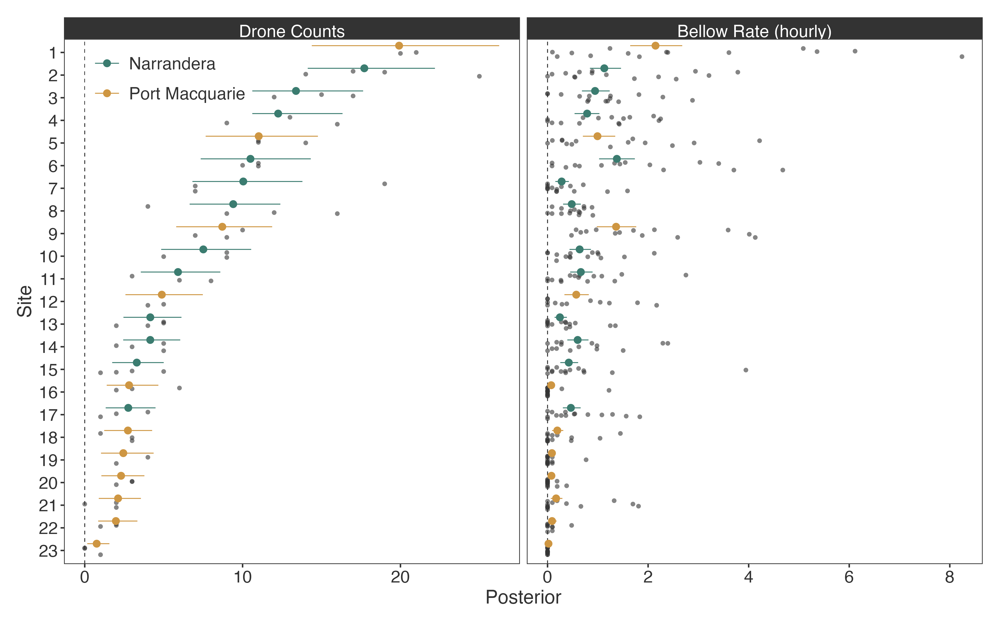
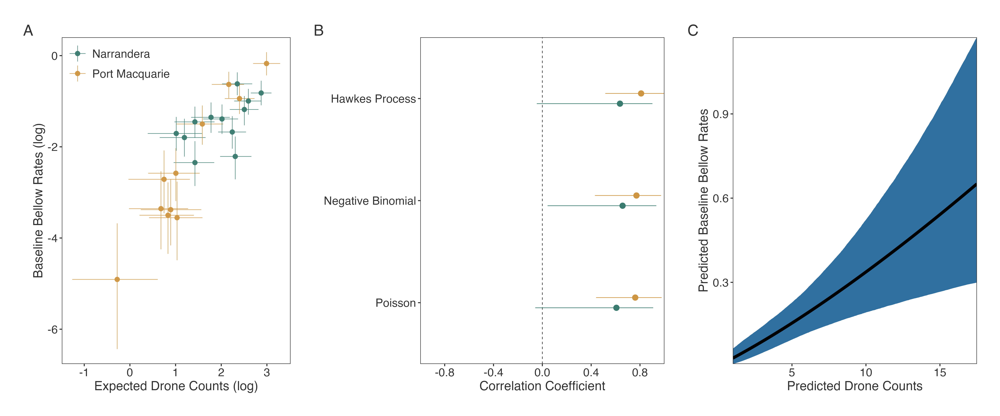
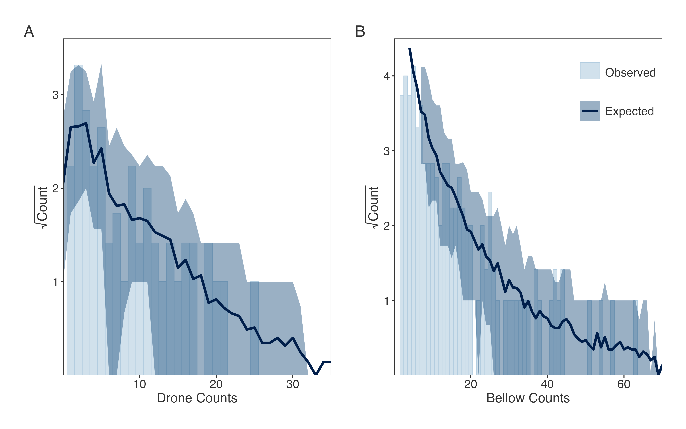

\newpage

```{r}
# setup
if (!require(pacman)) install.packages("pacman")
pacman::p_load(here, tidyverse, tidybayes, posterior, brms, tinytable)
options(scipen = 999, digits = 2)

# files
dat <- read_rds(here("data/dat.rds")) |> drop_na()
stan_data <- read_rds(here("data/stan-data-pair.rds"))
I <- stan_data$I ; J <- stan_data$J
fits <- read_rds(here("analysis/fits/fits-pair.rds"))
loos <- map(fits, ~.$loo())
stack <- loo_model_weights(loos)
fit <- fits[[2]]
```

# Introduction

Robust estimates of population density and trends are critical for effective conservation of threatened species at varying management scales [@callaghan2024]. Unlike occupancy, which reflects presence or absence, abundance measures provide quantitative insight into population size and allow earlier detection of declines, as declining abundance typically precede local extirpation. However, obtaining precise abundance estimates in wild populations remains challenging. Common abundance-based methods such as mark-recapture, distance sampling, or repeated direct animal counts are often resource-intensive and rely on assumptions about detectability, site closure, and survey consistency [@schwarz1996; @thomas2010]. These logistical and analytical constraints can often limit collecting direct abundance related data needed for broad-scale or long-term threatened species monitoring. Consequently, many programs use indices of relative abundance, such as counts per unit effort, detection frequency, or vocalisation rate, which can offer scalable alternatives if their relationship with true abundance is validated [@stephens2015; @falcy2016; @moriarty2018]. These indices, while often less precise, retain many of the advantages of direct abundance data and can substantially improve the sensitivity and inferential value of monitoring efforts when applied carefully [@simard2012].

Passive acoustic monitoring (PAM) using automated recording units (ARUs) is a popular, cost effective, and scaleable approach to monitor animal species that vocalise [@ross2023]. PAM data are often used in presence/absence analyses such as occupancy models because recorded vocalisations can usually not be linked to specific individuals, hindering direct inference on local abundance. Restricting the scope of one's monitoring approach to (changes) in occupancy, however, limits population inference as changes in site-level occupancy are a coarse criterion for species trends, especially if changes in occupancy are interpreted as local extirpation or colonisation. Instead, leveraging PAM data to also provide insight on local abundance would permit investigators to make make inference on a less conservative scale, such as trends in local abundance over time.

Various methods have been proposed to relate PAM data to local abundance, including distance-based metrics [@yip2020; @navine2024], soundscape methods using dense arrays of ARUs [@blumstein2011; @law2021], and relating a vocalisation rate (number of vocalisations per unit of time) to auxiliary measures of abundance (i.e., point count surveys) [@vanwilgenburg2017; @bombaci2018; @hutschenreiter2024; @navine2024]. However, the relationship between vocalisation rates and local abundance is likely to be species-specific---although it is probably a reasonable assumption that the relationship is positive, validating the relationship in the field is crucial in order to justify the use of vocalisation rates as a proxy for abundance.

There are some challenges associated with estimating vocalisation rates, with overdispersion due to auto-correlation or behaviour being common. Overdispersion occurs when the variance in the observed outcome is greater than that predicted by the statistical model; particularly for count data that is typically modeled as Poisson, there is a restrictive assumption that the variance is equal to the mean. Vocalisation data often shows high variability due to variation in the presence of individuals and vocalisation behaviour. Where some previous approaches estimating a vocalisation rate have relied on counting the number of arbitrarily chosen time intervals containing a vocalisation (or their proportion) [@hutschenreiter2024; @navine2024], another approach involves modeling the waiting times between recorded vocalisations directly. This permits a great degree of flexibility, where for instance the assumption of a constant vocalisation rate can be modeled with an exponential distribution (implying that the number of vocalisations is Poisson distributed). In case of overdispersion, alternative implied distributions can be used (e.g. negative binomial), or overdispersion in the waiting times can be modeled directly using for instance a Hawkes process, a type of self-exciting point process that models detections conditional on detections that came prior [@hawkes1971; @rushing2023]. Hawkes processes have clear ecological interpretation, namely that once a vocalisation has been recorded, additional vocalisations are likely (e.g., due to individuals repeatedly calling or responding to another), which eventually drops back to a baseline.

The koala (*Phascolarctos cinereus*), an Australian endemic species recently listed as Endangered under Environment Protection and Biodiversity Conservation (EPBC) Act 1999 (combined populations Queensland, New South Wales, and Australian Capital Territory), is extensively monitored throughout its distribution using acoustic ARUs to detect bellows (male vocalisations). Several recent studies have highlighted the cost-effectiveness of ARUs for describing patterns in koala occupancy relative to alternative techniques such as spotlighting or camera trapping, largely due to their ease of deployment and extended survey durations. For example, recent assessments comparing PAM, camera trapping, and thermal drone counts found that PAM was the most cost effective and efficient monitoring method to detect changes in koala occupancy [@beranek2024; @gillespie2025]. Acoustic recorders have also been used to estimate koala density by deploying multiple overlapping acoustic sensors into gridded arrays [@law2021]. However, this approach is deemed too costly to scale up to large geographic areas such as the statewide acoustic monitoring programs currently implemented by the NSW government conservation agency. Extending the use of PAM for koalas to make inference about (relative) single site level abundance could justify PAM as the de facto relative abundance monitoring tool for koalas at scales of regional and statewide management importance. This requires quantifying the relationship between bellow rate and local abundance, ideally through paired counts and acoustic data [@vanwilgenburg2017]. Thermal drone counts are currently the benchmark for directly detecting individual koalas, allowing highly accurate koala detection and effective survey at scales compared to other commonly used koala abundance related survey approaches [@gillespie2025]. Consequently, pairing abundance estimates derived from drone surveys with koala bellow rate estimates derived from concurrently deployed ARUs provides an opportunity to determine if koala bellow rates scale positively with local abundance [@witt2020].  

In this study, we investigated the relationship between koala bellow rates and thermal drone counts, under the assumption that drone counts provide a reliable indication of local abundance. We flew drones and recorded koala bellows concurrently at 23 sites in New South Wales (NSW), Australia, replicated 2--4 times per site and estimated correlation coefficients between estimated expected drone counts and bellow rates. We show that despite high variability in koala bellow rates, drone counts are highly correlated with bellow rates at the site level (~0.8), suggesting that estimated bellow rates in PAM monitoring schemes can be used as a proxy for local abundance.

\newpage

# Methods

## Study area

The study area comprised two regions with known density gradients thought to represent the entire variation in koala densities for New South Wales (0--2 koalas/ha) (Jessop et al. unpublished data). These included the River Red Gum (*Eucalyptus camaldulensis*) dominated habitats in the Narrandera common and the Murrumbidgee Regional Park adjacent to Narrandera township, NSW (-34.7475°, 146.5510°). The second survey area was located in Lake Innes Nature Reserve and Limeburners Creek National Park located either side of the Hastings River (-31.4308°, 152.9089°). Port Macquarie is situated on the NSW Mid North Coast, at the mouth of the Hastings River. The coastal forests here comprise mixed eucalypt species with dominant canopy species including *E. robusta*, *E. microcorys*, *E. pilularis*, and *E. propinqua* being recognized as important feed trees for koalas in terms of palatability and nutritional value. Additionally, these regions were also selected as home range sizes of GPS tracked koalas in these areas were equal to or smaller than drone plots (Le Pla et al. unpublished data).

## Survey design

Our study design was informed by previously acquired drone koala count data based off recent drone surveys (1--3 months prior). We selected 12 sites in Narrandera and 11 in Port Macquarie. Site selection represented a compromise between selecting plots that captured the broad gradient in koala densities that occur within these regions. To help facilitate direct comparison (i.e. spatial congruence) between koala detections and bellows we ensured that drone sampling was centered around the ARU. Here a drone survey area was 25 ha, corresponding roughly to the assumed 25 ha ARU acoustic detection area with a detection radius of 300 m.

## Drone surveys

Drone surveys were conducted with a quadcopter drone (DJI Matrice 30T), equipped with a 48MP zoom camera (visible spectrum), a 640 $\times$ 512px 30fps thermal camera, and a 1200 lux LP12 spotlight. All drone surveys maintained a consistent speed of 8 m/s and elevation of 65 m (20--40 m above the forest canopy). The drone flights followed an automated "lawnmower" flight pattern (parallel line-transects with approximately 60 m swath width) with a 10% overlap to ensure complete coverage of each 25 ha survey site. The same pilot overrided the programmed flight to manually inspect potential koala sightings. All surveys took place at night (20:00--03:00) to align with temperatures below 18°C (ranging from 6--18°C), which enhanced the thermal contrast between animals and their environment, aiding detection. Surveys were executed only under optimal drone flying conditions: wind speeds under 15 m/s and clear skies, without rain, clouds, or fog that could hinder visibility. Drone-generated footage was examined in real-time by the pilot viewing the footage on 14 cm widescreen DJI RC plus remote controller. The drone’s thermal camera was employed to spot koalas based on the contrast of any arboreal large animal-like thermal signature against the surrounding vegetation. To validate species identity, the drone hovered above all potential thermal detections and the pilot used the drone’s zoom visible spectrum camera, and spotlight to confirm a koala detection. All koala detections and relevant survey variables were logged in real-time using a customised data proforma in Survey123 (survey123.arcgis.com).

## Koala bellow recording and processing

A single acoustic recording unit with one microphone (SongMeter Mini, Wildlife Acoustics, Maynard, MA, USA) was deployed at the centroid of each site. Acoustic recorders were affixed to trees using cable ties at a standard height of 150 cm. Each acoustic recorder recorded between 14 and 21 nights (during September and late November to capture the breeding season when male koalas are most vocal [@law2018; @law2020]. Acoustic recorders were programmed to record from sunset to sunrise, coinciding with the peak daily calling period of koalas [@ellis2011; @law2020]. Acoustic recorders recorded audio data at a sampling rate of 22,050 Hz and a resolution of 16 bits per sample. Acoustic recorders are believed to have up to a 300 m omnidirectional sampling radius [@law2022], potentially allowing them to sample a similar sized area as drone surveys (~ 28 ha). Daily koala bellowing activity was sourced from the audio files using the NSW Department of Primary Industry’s (DPI) koala recognisers (Koala_CNN_LG_010822 and DPI_Male_Koala_V3_CNN15_10-02-23), run in the AviaNZ software. All putative koala calls were subsequently human validated by visual and audio inspection of the spectrograms and recordings to check for false positives. Only males are included in call activity data and presence/absence data.

## Statistical analysis

We jointly modeled the $N=71$ koala drone and bellow counts recorded by SongMeters to estimate the correlation between drone counts and bellow rates using the pairwise repeated measures at the level of sites and dates. We used the probabalistic programming language Stan [@carpenter2017] through CmdStanR 0.9.0 [@gabry2025] in R 4.5.1 [@rcoreteam2025] and used visual posterior predictive checks using "rootograms" [@sailynojaa] and approximate leave-one-out cross-validation (LOO-CV), including model stacking [@yao2018], as implemented in the loo package [@vehtari2024] to assess model fit and aid in model selection. We fit various configurations where drone and bellow counts were modeled with Poisson or negative binomial distributions. Each model included bivariate lognormal site and survey (date) effects to estimate correlations between site- and survey-level drone and bellow counts, as well as fixed region (Narrandera and Port Macquarie) and (standardised) meteorological effects of (quadratic) temperature and (log) windspeed collected by the drone pilot, as these were previously shown to impact koala detection probabilities [@beranek2024]. Because there was variation in the areas surveyed by the thermal drones, we included plot size as an offset for the drone counts. Our primary estimand was the correlation coefficient between expected site-level drone counts and bellow rates.

In order to capture some of the overdispersion in the bellow data, we also fit models with Hawkes processes instead of a negative binomial distribution for the bellow rates. Briefly, Hawkes processes are self-exciting point processes that can be used to model the bellow rate as a function of the bellows that came prior, where the rate increases immediately after a bellow is recorded and subsequently declines back to a baseline rate $\mu$ [@hawkes1971; @oshea2020; @rushing2023]. Hawkes processes can therefore potentially capture some ecological aspect of the overdispersion, such as a single male vocalising multiple times or koalas vocalising to each other. Modeling with Hawkes processes with exponential intensity adds two parameters to the models, namely (1) the increase in the bellow rate following a recorded bellow ($\alpha$) and (2) the rate at which the bellow rate subsequently declines back to baseline ($\beta$). The log likelihood of a Hawkes process with exponential intensity function is provided, where $\Delta$ is the total amount of time (i.e., how long an ARU was running for a survey night), $B$ is the number of bellows recorded, and $\mathbf{y}$ is a vector of length $B+1$ of waiting times between detections, where the last value is the time from the last detection to the end of the survey (or $\Delta$ if no detections were made):

$$
\begin{aligned}
  \mathcal{H} \left( \mathbf{y} \mid \mu, \alpha, \beta, \Delta, B \right) = &\sum_{b=1}^B \log \left( \mu + \alpha A_b \right) - \mu \times \Delta \\
                     &+ \frac{\alpha}{\beta} \sum_{b=1}^{B + 1} \Biggl\{ \exp \biggl[ -\beta \left( \Delta - \sum_{c=1}^b \mathbf{y}_c \right) \biggr] - 1 \Biggr\},
\end{aligned}
$${#eq-hp}

where $A_1 = 0$ and $A_b = \exp(-\beta y_b) (1 + A_{b - 1}) \forall b \in 2:B$. The expected number of detections given the Hawkes process is $\frac{\mu}{1-\alpha/\beta}$, which is useful for predicting the number of bellows, i.e. for posterior predictive checks. If no detections are made, the log likelihood is simply $-\mu \Delta$, the log complement of the cumulative distribution function of the exponential distribution.

Models with Hawkes processes condition on the waiting times between detections instead of the number of bellows themselves. Therefore, in order to compare the models with LOO-CV, we also modeled the waiting times directly in the Poisson and negative binomial models without Hawkes processes. For these models, we leveraged the fact that counts generated by $\mathcal{P} \left( \mu \right)$ assume waiting times generated by $\mathcal{E} \left( \mu \right)$, where $\mathcal{P}$ and $\mathcal{E}$ represent the Poisson and exponential distributions, respectively. We used the gamma-Poisson mixture parameterisation for the negative binomial distribution to work with waiting times directly by adding observation-level random effects $u_n \sim \mathcal{G} (\phi, \phi)$, where $\phi$ is the overdispersion parameter in the mean/dispersion parameterisation of the negative binomial and $\mathcal{G}$ indicates the gamma distribution. Although these models are mathematically equivalent to modeling the observed bellow counts with Poisson and negative binomial distributions, the pointwise log likelihood values are not the same because the underlying data are different. 

The assumed data-generating process (sans priors) for our top model (according to LOO-CV, @tbl-loo) was as follows, for surveys $n = 1, \dots, 73$ from sites $i = 1, \dots, 23$ nested in regions $r = 1, 2$ and dates $j = 1, \dots, 23$, where $C_n$ are the drone counts and $\mathbf{y}_n$ are the vectors of waiting times between $D_n$ koala bellows:

$$
\begin{aligned}
  C_n &\sim \mathcal{P} \left( {\mu_1}_{[n]} \right) \\
  {\mathbf{times}_n} &\sim \mathcal{H} \left( {\mu_2}_{[n]}, \alpha, \beta, \Delta_n, B_n \right) \\
  \boldsymbol{\mu}_n &= \exp \left( \log \left({\boldsymbol{\gamma_0}}_{[r_n]}\right) +  \boldsymbol{\gamma} \boldsymbol{X}_n + {\boldsymbol{\theta}}_{i_{[n]}} + {\boldsymbol{\epsilon}}_{j_{[n]}}  \right) \\
  \boldsymbol{\theta}_i &\sim \mathcal{N} \left( \boldsymbol{0}, {\boldsymbol{\Sigma}_\theta}_{[i_n]} \right) \\
  \boldsymbol{\epsilon}_j &\sim \mathcal{N} \left( \boldsymbol{0}, {\boldsymbol{\Sigma}_\epsilon}_{[j_n]} \right),
\end{aligned}
$${#eq-mod}

where $\boldsymbol{\gamma} \boldsymbol{X}$ are the fixed effects of region, temperature, and wind, and $\boldsymbol{\theta}$ and $\boldsymbol{\epsilon}$ are the bivariate random site- and survey-level effect. Note that the region-level covariance matrices for these random effects shared standard deviations between sites but estimated correlation coefficients separately for each region, e.g. ${\boldsymbol{\Sigma}_\theta}_{[r]} = \operatorname{diag} \left(\boldsymbol{\sigma} \right) \boldsymbol{\Omega}_r \operatorname{diag}\left(\boldsymbol{\sigma} \right)$, where $\operatorname{diag}\left(\boldsymbol{\sigma} \right)$ is a diagonal matrix of site-level scales of drone counts and bellow rates and $\boldsymbol{\Omega}_r$ are region-level correlation matrices.

We ran 10 Hamiltonian Monte Carlo (HMC) chains for 500 iterations after discarding 500 as warmup and summarise model parameters with posterior medians and 95% highest density intervals (HDIs). We specified weakly informative $\mathcal{E}\left(0.1 \right)$ priors for the intercepts on the original scale ($\boldsymbol{\gamma_0}$, representing the global average expected drone counts and bellow rates) and uniform priors over the correlation matrices of bivariate normal random effects. For negative binomial models, we used Stan's mean/dispersion parameterisation so that the expectation could remain the same as in the Poisson models and gave the recommended $\mathcal{IG}(0.4, 0.3)$ priors for the overdispersion parameters, where $\mathcal{IG}$ is the inverse gamma distribution. We used R2D2 priors for the fixed and random effect scales [@zhang2022], which places a prior on the $R^2$ of the models and enforces shrinkage on the predictors, using $\gamma_0^{-1}$ for the pseudo-variances [@piironen2017]. All models converged and had minimal diagnostic errors provided by Stan. We also fit a second round of models using the full ARU deployment period (excluding covariate effects since they were missing from nights without drone surveys). This analysis had the same top model and showed the same trends, so we only include the relevant figures in the appendix. For the fully reproducible Stan implementation, see [github.com/mhollanders/bellows](https://github.com/mhollanders/bellows).

\newpage

# Results

```{r}
# objects
summary <- dat |> 
  summarise(count = sum(count), 
            bellows = sum(bellows), 
            .by = site)
rho_a <- fit |> 
  spread_rvars(rho_a[d]) |> 
  median_hdi(rho_a)
mu <- fit |> 
  spread_rvars(mu[d, n]) |> 
  left_join(dat |> mutate(n = row_number()), by = "n") |> 
  summarise(mu = rvar_mean(mu), .by = c(d, site, region)) |> 
  summarise(mu = rvar_mean(mu), .by = c(d, region)) |> 
  median_hdi(mu) |> 
  arrange(d)
hp <- fit |> 
  spread_rvars(hp[i]) |> 
  median_hdi(hp)

# GLMs
fit_glm_p <- brm(bellows ~ log(count + 1) + offset(log(Delta)), 
                 data = dat |> 
                   mutate(Delta = as.numeric(Delta)), 
                 family = poisson(), backend = "cmdstanr", chains = 8, cores = 8) |> 
  add_criterion("loo")
fit_glm_nb <- brm(bellows ~ log(count + 1) + offset(log(Delta)), 
                  data = dat |> 
                    mutate(Delta = as.numeric(Delta)), 
                  family = negbinomial(), backend = "cmdstanr", chains = 8, cores = 8) |> 
  add_criterion("loo")
loo_compare(fit_glm_p, fit_glm_nb)
```

A total of `r sum(summary$count)` drone detections were made with `r sum(summary$bellows)` bellows recorded by SongMeters. Across the `r I` sites, `r sum(summary$count == 0)` had no drone detections but `r sum(summary$bellows == 0)` never recorded a koala bellow. The top model according to LOO-CV (@tbl-loo) and model stacking (model weight of `r max(stack)`) featured a Poisson distribution for the drone counts and a Hawkes process for the bellow counts. Observed drone and bellow counts are plotted alongside site-level predictions of the top model in @fig-mu. Models provided strong support for a highly positive correlation between site-level expected drone counts and estimated bellow rates, with our top model yielding an overall correlation coefficient of `r unlist(rho_a$rho_a[1])` (95% HDI: `r unlist(rho_a[1, 3:4])`), with region-level deviations being minor (@fig-rho). When the model fitting procedure was repeated for the full ARU data, including nights where drones were not flown, results were similar with identical conclusions (Appendix 1).

Drone counts and bellow rates were weakly negatively correlated at the survey (date) level (`r unlist(rho_a$rho_a[2])`, 95% HDI: `r unlist(rho_a[2, 3:4])`) and none of the meteorological predictor coefficients deviated much from 0. Expected drone counts were higher at Narrandera (`r unlist(mu$mu[2])`, 95% HDI: `r unlist(mu[2, 4:5])`) than at Port Macquarie (`r unlist(mu$mu[1])`, 95% HDI: `r unlist(mu[1, 4:5])`), but baseline hourly bellow rates were negligibly different (Narrandera: `r unlist(mu$mu[4])`, 95% HDI: `r unlist(mu[4, 4:5])`, Port Macquarie: `r unlist(mu$mu[3])`, 95% HDI: `r unlist(mu[3, 4:5])`). Using the Hawkes process, the bellow rates were estimated to increase by `r unlist(hp$hp[1])` (95% HDI: `r unlist(hp[1, 3:4])`, parameter $\alpha$) bellows per hour directly following a bellow and to decline back to baseline at a rate of `r unlist(hp$hp[2])` (95% HDI: `r unlist(hp[2, 3:4])`, parameter $\beta$) bellows per hour. Posterior predictive checks indicated good fit for both drone counts and bellows (@fig-ppc).

\newpage

# Discussion

This study is the first to evaluate the relationship between koala bellow rate and thermal drone-based counts across two natural population density gradients in NSW, Australia. We demonstrate a strong, positive correlation between site-level mean bellow rates and koala counts, indicating that vocalisation data derived from passive acoustic monitoring (PAM) may serve as a reliable proxy for local abundance. This finding is particularly significant for large-scale monitoring efforts, as PAM enables cost-effective, long-duration sampling with extensive spatial coverage. While acoustic methods are already well established for detecting koala presence and estimating occupancy, our results show that bellow rate can also yield meaningful information about relative abundance. This dual utility greatly enhances the value of existing acoustic infrastructure and offers new opportunities for integrating inference on local abundance into ongoing koala monitoring programs. Our findings align with a growing body of literature demonstrating positive relationships between vocalisation rate and population density in other species [@vanwilgenburg2017; @bombaci2018; @navine2024]. Below, we discuss statistical considerations, monitoring applications and future direction related to our findings that ideally seek to advance koala conservation through improved cost-effective acoustic-based monitoring.

## Statistical considerations

Bellow rates were overdispersed, which makes relating the bellow rate on any given night to abundance difficult. Models accounting for overdispersion in bellow rates using a Hawkes process or negative binomial distribution had higher expected log predictive densities (ELPD, a measure of predictive fit [@vehtari2017]) and yielded stronger correlations with site-level drone-based counts (@fig-rho). There may be ecological reasons why within sites, higher (temporary) abundance is associated with lower bellow rates in koalas. For example, adult male koalas will often move towards the bellows of conspecifics when heard, particularly those originating from smaller males [@jiang2022]. Consequently, small males may temporarily suppress calling if acoustic cues suggest larger males are nearby to avoid antagonistic interactions. Similarly, since females in oestrous spent more time in close proximity to speakers broadcasting bellows from large males in a controlled trial [@charlton2012], high temporary abundance despite lower below rates may be a product of females moving closer to the bellows of large males. Despite high daily variation in bellow rates, our results suggest site-level average bellow rates can be reliably estimated by ARU’s since they are generally deployed for several nights at least.

Our modeling approach focused on estimating the correlation between site-level expected drone counts and bellow rates to account for the hierarchy present in both data sources, which were replicated at site and date levels. Nevertheless, traditional Poisson and negative binomial GLMs modeling bellows ($B_n$) as a function of drone counts ($\log(C_n + 1)$) with survey interval offsets ($\Delta$) (`brms::brm(B ~ log(C + 1) + offset(log(Delta)))`) [@burkner2017] revealed strong positive effects of drone counts on bellow rates as well (0.50, 95% CI: 0.13, 0.88, in the LOO-CV preferred negative binomial model). This simplified approach fails to capture the complexity of the data, and analysing paired data with a multivariate random effects is a natural approach to relate paired count and acoustic data. 

## Monitoring applications

In the context of threatened species monitoring, the ability to measure both occupancy and abundance provides a more comprehensive understanding of population dynamics and conservation status [@nichols2006; @falaschi2025]. Occupancy data allow for the detection of range contractions and shifts in habitat use, while abundance metrics are critical for identifying early population declines, informing demographic trends, and assessing extinction risk. Our results suggest that ARUs, the current main method for broadscale koala occupancy estimation, may also serve as a viable proxy for making inference about relative abundance through bellow rate, at least at the scale measured here.

This approach offers several practical advantages. First, compared to drone-based abundance surveys, deploying song meters is substantially more cost-effective, particularly when high detection probabilities are required for robust population inference. This scalability makes acoustic monitoring an attractive option for long-term, landscape-level koala surveillance [@gillespie2025]. Second, extracting abundance-relevant information from acoustic data expands the utility of these datasets for a broader range of conservation objectives. These include tracking temporal trends in relative abundance (e.g., under climate or land-use change), evaluating population responses to targeted management interventions (e.g., translocation efforts, roadkill mitigation, or predator control), and reanalysing historical autonomous recording unit (ARU) datasets to extract abundance trends, rather than solely presence–absence [e.g., @law2021]. By enabling occupancy and abundance to be derived from the same monitoring infrastructure, this dual-purpose application of acoustic data enhances efficiency and expands the inferential power of koala monitoring programs. This integrated framework has potential not only for koalas, but for a range of vocally active threatened species where cost-effective abundance monitoring is currently limited.

## Future directions

The potential to use koala bellow (call) rate as an indirect index of abundance is promising, but contingent on satisfying two key conditions [@forsyth2007; @sollmann2013]. First, a well-designed validation study is essential to establish a strong, positive, and temporally and spatially consistent relationship between call rate and directly estimated koala density. Our initial findings provide encouraging evidence for this relationship (@fig-rho), but further validation across multiple regions and seasons is needed to ensure robustness and generalisability. A cost-effective approach would involve leveraging existing long-term acoustic monitoring programs and integrating strategically selected drone surveys at a representative subset of acoustic sites. This would help quantify spatial and temporal variability in the call rate–density relationship that remains unexplained.

Ideally, the call rate should vary predictably with true koala density, with a sufficiently steep slope to ensure sensitivity to changes in abundance. Moreover, both measures should exhibit comparable precision, so that inference based on call rate approximates the inferential power of direct density estimates. Due to the overdispersion in bellow rates, precision is lost in using bellow rate as a proxy for abundance, which may be a considerable limitation. A second consideration is the recognition that koala call rate is a biologically complex signal. It is not only influenced by population density, but also by behavioural factors (e.g., bellows as sexually selected signals), demographic structure (e.g., male-to-female ratio, breeding status), and environmental conditions (e.g., weather, habitat acoustics) [@ellis2011]. These factors may vary independently of underlying abundance and can introduce heterogeneity in call rates across space and time that makes fine-scale comparisons between any two locations challenging. For example, bellow rate suggested fundamentally different koala abundances between sites 8 and 9, using both the paired and the full analysis, yet this conclusion was unsupported by the accompanying drone count data (@fig-mu, @fig-mu2). Consequently, in the absence of covariates that adequately describe variance attributable to behavioural and environmental sources, we recommend caution when using site-level bellow rates to make pair-wise comparisons between specific locations. 

To maximise the reliability of call rate as an abundance proxy, further refinements in study design and statistical modelling are required. Specifically, new methods are needed to account for additional unmodelled heterogeneity, repeated calls from the same individual (non-independence), and potential false positives arising from the inability to identify individual koalas acoustically. While statistical approaches such as Hawkes processes offer some capacity to address temporal clustering in call data, they cannot fully resolve issues of caller non-identifiability or demographic signal complexity. Advancing this field will require combining targeted validation studies with the development of robust inferential models capable of extracting meaningful abundance signals from acoustic count data under realistic ecological constraints.

## Conclusions 

This study provides the first formal validation of koala bellow rate as a proxy for local abundance, demonstrating a strong, positive correlation between passive acoustic recordings and drone-derived koala counts across contrasting population density gradients. These findings represent a significant advance in the field of threatened species monitoring, showing that passive acoustic monitoring (PAM) can serve dual functions, accurately capturing both occupancy and relative abundance, using the same scalable, cost-effective infrastructure.

\newpage

# References

::: {#refs}
:::

\newpage

# Tables

```{r}
#| output: true
#| label: tbl-loo
#| tbl-cap: Model variants and the differences (with standard errors) of their expected log predictive densities (ELPD), using the loo R package [@vehtari2024].

tribble(
  ~`Drone Counts`, ~`Bellows`,
  "Poisson", "Poisson",
  "Poisson", "Hawkes Process",
  "Poisson", "Negative Binomial",
  "Negative Binomial", "Poisson",
  "Negative Binomial", "Hawkes Process",
  "Negative Binomial", "Negative Binomial"
) |> 
  mutate(model = str_c("model", row_number())) |> 
  left_join(loo_compare(loos) |> 
              as_tibble(rownames = "model") |> 
              select(1:4)) |> 
  arrange(desc(as.numeric(elpd_loo))) |> 
  select(-c(model, elpd_loo)) |> 
  knitr::kable()
```


\newpage

# Figures

![Posterior distributions (summarised with medians and 95% HDIs) of the site-level predicted drone counts and hourly bellow rates alongside observed drone and bellow counts. Estimates come from the top model featuring a Poisson distribution for drone counts and a Hawkes process for the bellow rates, with expected hourly bellow rates predicted as $\frac{\mu}{1-\alpha/\beta}$, where $\mu$ is the baseline bellow rate and $\alpha$ and $\beta$ are Hawkes process parameters (@eq-mod). The site-level correlation coefficient between expected drone counts and the baseline bellow rate was `r unlist(rho_a$rho_a[1])` (95% HDI: `r unlist(rho_a[1, 3:4])`).](../figs/fig-mu-pair.png){#fig-mu}

\newpage

![(A) Posterior distributions (summarised with medians and 95% HDIs) of the site-level (log) expected counts and baseline hourly bellow rates, which featured a Hawkes process for bellow rates. (B) Posterior distributions of the region-level correlation coefficients of the bivariate lognormal site effects, using a Poisson distribution for drone counts and three differing distributions for bellow rates. (C) Predicted site-level bellow rates conditioned on site-level expected drone counts, $\theta_2 = \log{\gamma_0}_{[2]} + \rho \frac{\sigma_2}{\sigma_1} \left( \theta_1 -  \log{\gamma_0}_{[1]} \right)$ (@eq-mod). ](../figs/fig-rho-pair.png){#fig-rho}

\newpage

![Posterior predictive checks using "rootograms" [@sailynojaa] for (A) drone and (B) bellow counts for the top model, where bellow counts were predicted as $\mathcal{P} \left( \frac{\mu}{1-\alpha/\beta} \right)$.](../figs/fig-ppc-pair.png){#fig-ppc}

\newpage

# Appendix: Results of full analysis

```{r}
# files
fits <- read_rds(here("analysis/fits/fits-full.rds"))
loos <- map(fits, ~.$loo())
stack <- loo_model_weights(loos)
fit <- fits[[2]]
```


In addition to the paired drone count and bellow data described in the text, we also fit a model where the full SongMeter deployment was used to estimate bellow rate parameters, excluding covariate effects as these were not recorded on nights without drone counts. The model structure and our primary estimands, the correlation coefficients between site-level drone counts and bellow rates, are still estimable when not all nights are paired. The results of this analysis very similar results as the primary analysis, albeit with more precision on bellow rate parameters, with the model comparison using loo resulting in the same model ordering. The top model (with Hawkes process) now had a model weight of `r max(stack)`. These models were preferred because both are capable of capturing the overdispersion in the bellow data.

{#fig-mu2}

\newpage

{#fig-rho2}

\newpage

{#fig-rho2}
